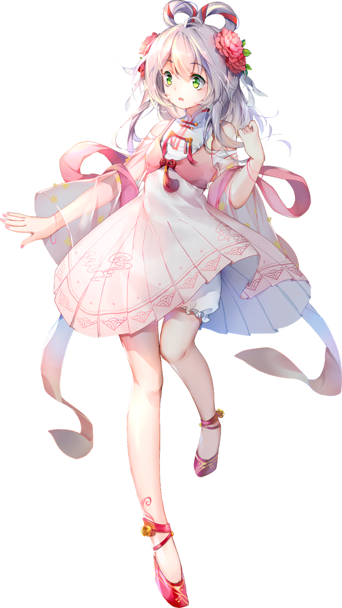

    <picture>
        <source media="(max-width: 767px)" srcset="../github-metrics.svg" width="100%">
        
    </picture>
    <picture>
        <source media="(max-width: 767px)" srcset="../assets/luotianyi.webp" width="100%">
        
    </picture>

